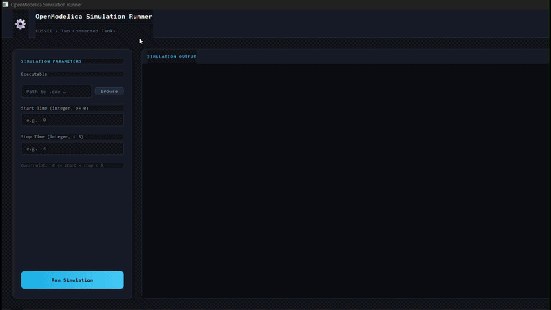
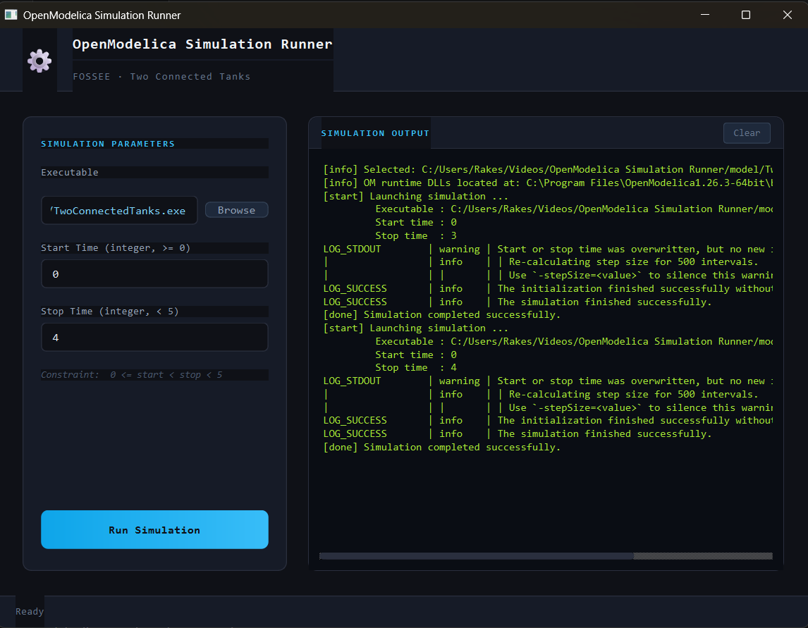
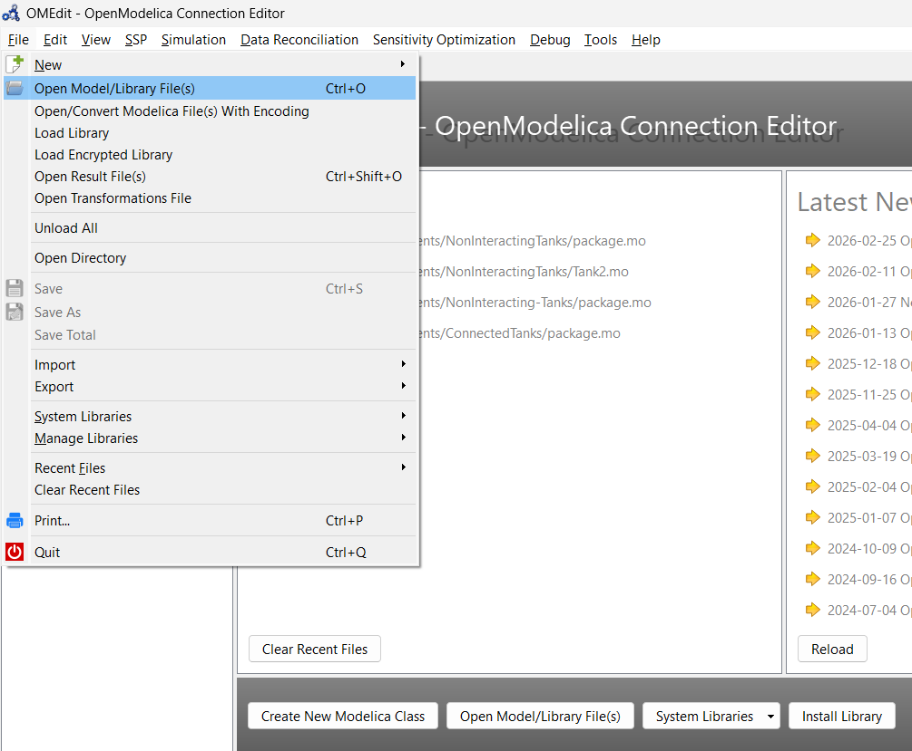
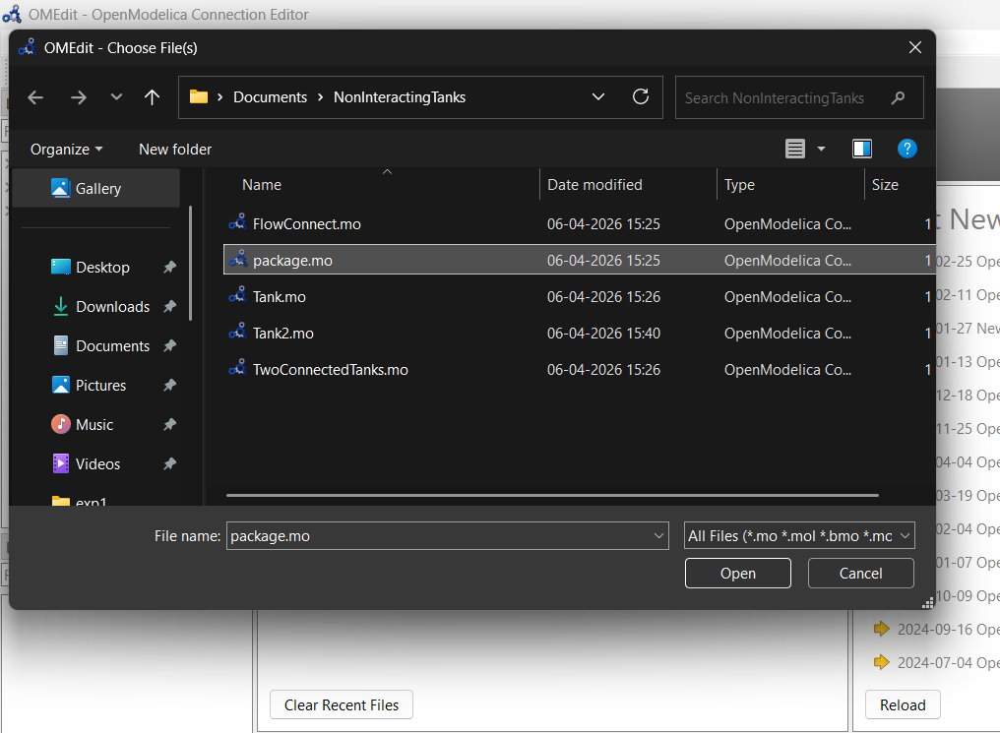
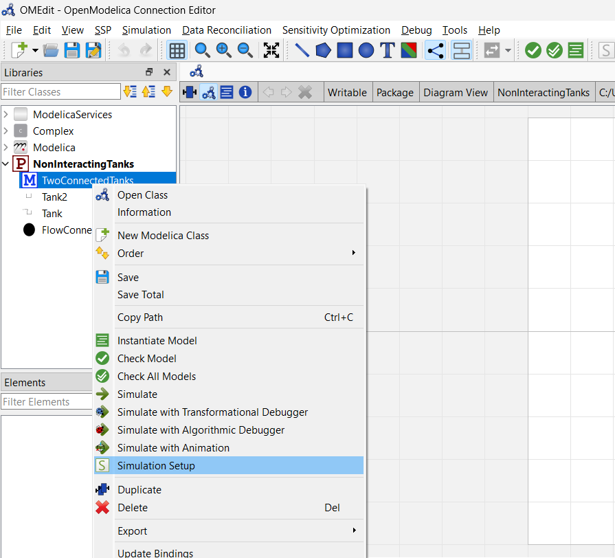
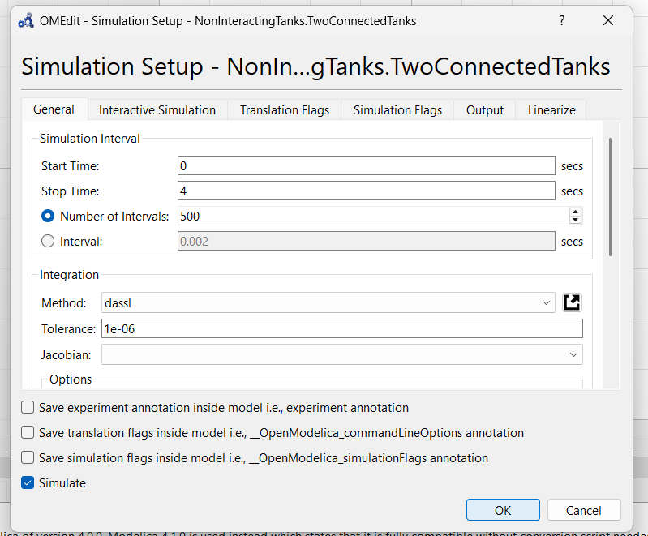
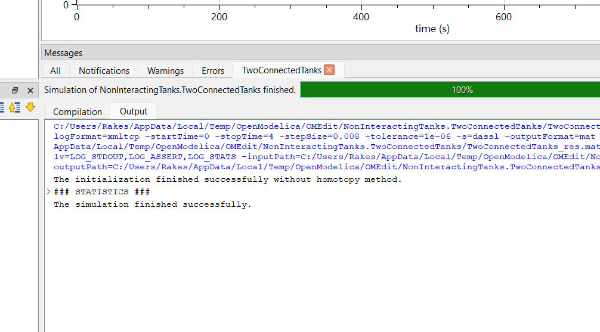

---

# OpenModelica Simulator (PyQt6 Desktop Application)

<p align="center">
  
</p>

<p align="center">
  <a href="assets/openmodelica-simulator-demo.mp4">
    View Full Demonstration Video (MP4)
  </a>
</p>



## Overview

This project is a desktop application built using Python and PyQt6 to run simulation executables generated from OpenModelica. It provides a simple interface for selecting an executable, specifying simulation parameters, and executing the model.

The application connects OpenModelica simulations with a graphical user interface, making it easier to run and verify simulation results without using the command line.

---

## Features

* Select and run an OpenModelica-generated executable file
* Input simulation parameters such as start time and stop time
* Execute simulations through a graphical interface
* Display execution output within the application
* Validate input constraints
* Verify simulation results using the generated `.mat` file

---

## Project Structure

```
OpenModelica-Simulator/
│
├── src/
│   ├── main.py              # Entry point for the application
│   ├── _check_mat.py        # Script to verify .mat file updates
│
├── assets/
│   └── simulator-root.png   # Screenshot of the application
│
├── model/
│   ├── TwoConnectedTanks.exe
│   ├── (dependency files such as .dll, .xml, .mat)
│
├── NonInteractingTanks/
│   ├── package.mo
│   ├── Tank.mo
│   ├── Tank2.mo
│   ├── flowConnect.mo
│   ├── TwoConnectedTanks.mo
│
├── requirements.txt
├── .gitignore
├── LICENSE
├── README.md
```

---

## Generating the Simulation Executable

Follow these steps to generate the executable using OpenModelica.

### Step 1: Open the Modelica Package

Open OpenModelica Connection Editor and load the file:

```
NonInteractingTanks/package.mo
```

### Step 2: Build the Model

Locate the model named `TwoConnectedTanks` and run the simulation.

### Step 3: Generate Executable

After successful simulation, OpenModelica generates:

* `TwoConnectedTanks.exe`
* Supporting dependency files

### Step 4: Move Files

Copy all generated files into the `model/` directory.

---

## OpenModelica Setup (Step-by-Step)

<table>
  <tr>
    <td align="center">
      <b>Step 1</b><br>
      
    </td>
    <td align="center">
      <b>Step 2</b><br>
      
    </td>
  </tr>
  <tr>
    <td align="center">
      <b>Step 3</b><br>
      
    </td>
    <td align="center">
      <b>Step 4</b><br>
      
    </td>
  </tr>
</table>

<p align="center">
  <b>Step 5</b><br>
  
</p>

---

## Running the Application

### Install Dependencies

```
pip install -r requirements.txt
```

### Run the Application

```
cd src
python main.py
```

---

## Usage

1. Launch the application
2. Select the executable file from the `model/` directory
3. Enter the start time (greater than or equal to 0)
4. Enter the stop time (less than 5 and greater than start time)
5. Click on "Run Simulation"
6. The output will be displayed in the application

---

## Verifying Simulation Output

To verify whether the simulation executed correctly:

```
python src/_check_mat.py
```

This script reads the `.mat` file from the `model/` directory and confirms that it has been updated after simulation.

---

## Requirements

* Python 3.6 or higher
* PyQt6
* SciPy
* OpenModelica

Install dependencies using:

```
pip install -r requirements.txt
```

---

## Notes

* Ensure all dependency files generated by OpenModelica are placed in the `model/` directory along with the executable
* The executable will not run correctly if required files are missing
* Input values must satisfy the condition: 0 ≤ start time < stop time < 5

---

## License

This project is licensed under the terms specified in the LICENSE file.
